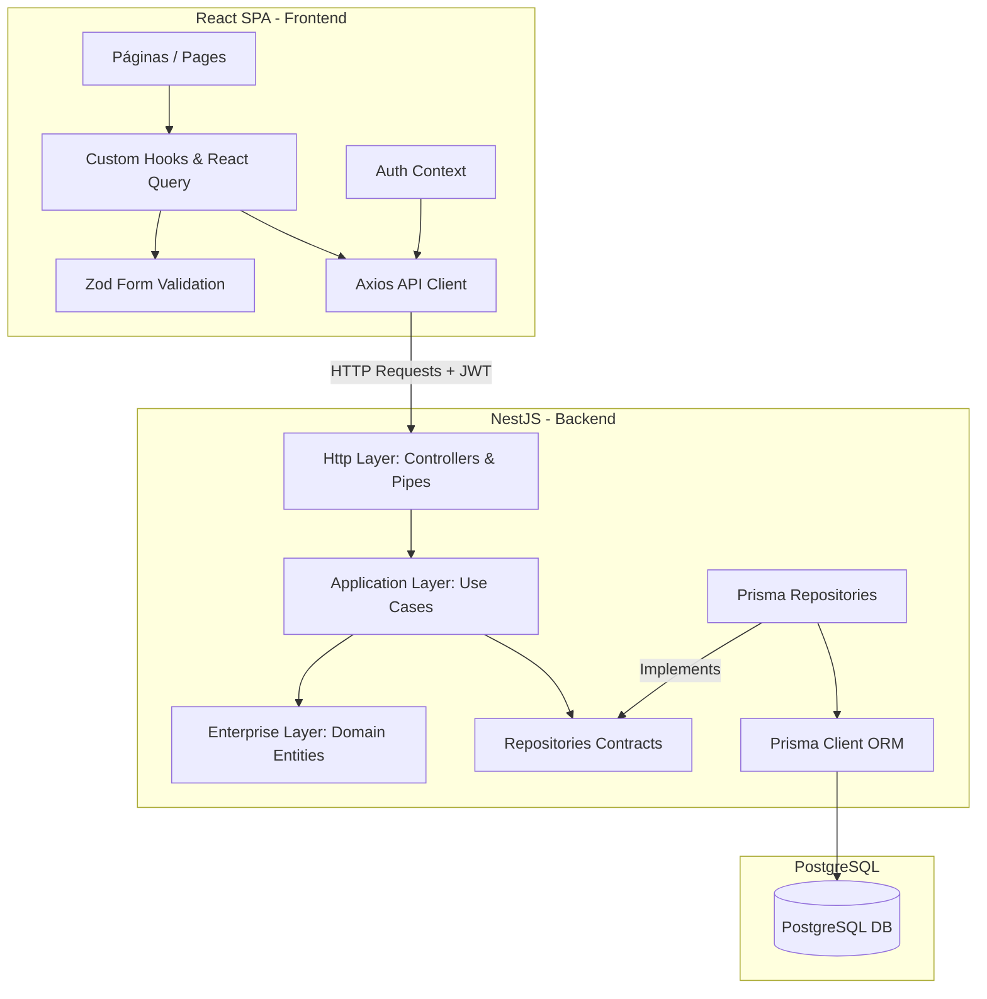

# 🏗️ Arquitetura Geral do Projeto - Waste Control

Este documento apresenta uma análise detalhada da arquitetura do projeto **Waste Control**, um sistema completo (Backend e Frontend) projetado para monitorar e reduzir o desperdício de alimentos em restaurantes.

O projeto é estruturado em duas pastas principais no nível raiz:
1. **[backend](file:///c:/www/nodejs/api-waste-control/backend)**: API REST desenvolvida em Node.js com o framework **NestJS**.
2. **[frontend](file:///c:/www/nodejs/api-waste-control/frontend)**: Aplicação web (SPA) desenvolvida em **React 19**, **TypeScript** e **Vite 8**.

---

## 🗺️ Fluxo de Comunicação e Integração

O diagrama abaixo ilustra como as duas partes interagem entre si, desde a interface do usuário até o banco de dados:

---

## 1. Análise Detalhada do Backend

A aplicação backend reside na pasta **[backend](file:///c:/www/nodejs/api-waste-control/backend)** e foi projetada seguindo os princípios de **Clean Architecture** (Arquitetura Limpa) e **DDD (Domain-Driven Design)**. Isso garante que a lógica de negócios central esteja completamente isolada de frameworks, bancos de dados ou detalhes de infraestrutura.

A pasta principal de código está em **[backend/src](file:///c:/www/nodejs/api-waste-control/backend/src)** e está dividida em três camadas conceituais:

### A. Core (`src/core`)
Contém utilitários globais reutilizáveis compartilhados por toda a aplicação.
* **Tratamento de Erros Funcional**: Utiliza a estrutura helper funcional `either.ts` para retornar erros (`Left`) ou sucessos (`Right`) de forma tipada e explícita, evitando o lançamento descontrolado de exceções (`throw new Error`).
* **Classe base de Entidade (`Entity`)**: Abstração de identificadores únicos (UUIDs) herdada por todas as entidades do domínio.

### B. Domain (`src/domain`)
O núcleo do sistema. Não possui dependências de bibliotecas externas ou do NestJS.
* **`enterprise`**: Entidades ricas e regras de negócio puras (ex: `User`, `Category`, `Food`, `Meal`, `MealItem`, `Waste`).
* **`application`**: Casos de uso (Use Cases) que executam ações orquestradas de negócio e definem contratos de comunicação, tais como interfaces de repositórios (`UserRepository`, `FoodRepository`, etc.) e contratos de criptografia.

### C. Infra (`src/infra`)
Contém detalhes de implementação e a integração com o framework NestJS.
* **`database`**: Conexão com o banco de dados via **Prisma ORM** e implementações concretas dos repositórios definidos no domínio (`PrismaUsersRepository`, etc.).
* **`http`**: Camada de rede contendo os controladores REST (`controllers`), serialização de respostas (`presenters`) e validação de parâmetros com Zod (`pipes`).
* **`auth` & `cryptography`**: Segurança da aplicação, incluindo estratégias do Passport, guardas JWT para rotas privadas e hash de senhas com bcryptjs.
* **`env`**: Configuração e validação estrita de variáveis de ambiente do sistema.

### 🛢️ Modelagem de Banco de Dados (`schema.prisma`)
O banco de dados PostgreSQL é mapeado através do arquivo **[schema.prisma](file:///c:/www/nodejs/api-waste-control/backend/prisma/schema.prisma)**. As principais entidades e seus relacionamentos são:

* **`User`**: Usuários do sistema com papéis (`RolesType`: `ADMIN` ou `EMPLOYEE`). Podem criar/registrar refeições.
* **`Category`**: Categorias de alimentos (ex: Proteínas, Carboidratos).
* **`Food`**: Alimentos cadastrados vinculados a uma `Category`.
* **`Meal`**: Refeições registradas em uma data e turno (`TurnsType`: `AFTERNOON` ou `DINNER`), associadas ao `User` que a registrou.
* **`MealItem`**: Tabela de junção que representa quais alimentos foram servidos em uma refeição específica, registrando as quantidades servidas (`quantityServed`) e consumidas (`quantityConsumed`).
* **`Waste`**: Registro de desperdício mapeado para um `MealItem`. Armazena a quantidade desperdiçada e o motivo (`ReasonType`: `LEFTOVER` (sobra limpa), `ITSPOILED` (estragado), `ERROR_PREPARATION` (erro de preparo)).

---

## 2. Análise Detalhada do Frontend

A aplicação frontend está localizada em **[frontend](file:///c:/www/nodejs/api-waste-control/frontend)**. É um portal responsivo construído com tecnologias modernas voltadas para excelente experiência de desenvolvimento (DX) e desempenho em tempo real.

A pasta principal de código está em **[frontend/src](file:///c:/www/nodejs/api-waste-control/frontend/src)** e sua arquitetura é baseada na separação de interesses:

### A. Rotas e Fluxo de Autenticação (`App.tsx` & `contexts`)
* A navegação é gerida pelo **React Router DOM** no [App.tsx](file:///c:/www/nodejs/api-waste-control/frontend/src/App.tsx).
* Há uma rota privada abstrata (`PrivateRoute`) protegendo o acesso às telas internas do painel de administração.
* O **[auth-context.tsx](file:///c:/www/nodejs/api-waste-control/frontend/src/contexts/auth-context.tsx)** armazena o estado global de autenticação do usuário logado, descriptografando o token JWT salvo no `localStorage` e verificando se este já expirou.

### B. Custom Hooks & Integração com API (`src/hooks` & `helpers/api.ts`)
* Em vez de fazer chamadas diretas para a API de dentro das páginas, toda a lógica assíncrona é encapsulada em hooks personalizados (ex: `useFetchCategories`, `usePostMeal`, `useDeleteFood`).
* Esses hooks utilizam o **@tanstack/react-query** para gerenciar o estado da requisição (carregamento, sucesso, erro), fazer cache local e sincronizar atualizações em tempo real com facilidade.
* O cliente HTTP é configurado em **[api.ts](file:///c:/www/nodejs/api-waste-control/frontend/src/helpers/api.ts)** usando **Axios**. Ele possui interceptadores que injetam automaticamente o cabeçalho `Authorization: Bearer <token>` nas requisições e redirecionam o usuário de volta para o login caso a API retorne um erro `401 Unauthorized`.

### C. Páginas (`src/pages`) e Componentes (`src/components`)
* As interfaces de usuário são estruturadas em páginas focadas em recursos específicos do negócio:
  * `page-dashboard`: Exibe painéis informativos do desperdício de alimentos.
  * `page-category`: Cadastro e listagem de categorias de alimentos.
  * `page-food`: Cadastro e listagem de alimentos.
  * `page-meal`: Gerenciamento e cadastro de turnos de refeições.
  * `page-details-food`: Detalhes e adição de itens específicos consumidos em cada refeição.
  * `page-waste`: Registro detalhado de desperdícios por motivo.
* O design utiliza componentes reutilizáveis atômicos localizados em **[components](file:///c:/www/nodejs/api-waste-control/frontend/src/components)** (botões, cards, inputs, selects com validações embutidas).

### D. Validação e Tipagem (`src/schemas` & `src/models`)
* **Validação de Formulários**: Utiliza **Zod** para criar esquemas de validação rígidos no cliente (ex: `categoryFormZodSchema.ts`, `foodFormZodSchema.ts`). Integrados com o `react-hook-form` via `@hookform/resolvers`, garantem que o usuário não consiga submeter dados inválidos.
* **Modelos**: Interfaces TypeScript puras (`src/models`) garantem a tipagem forte de objetos manipulados no frontend, combinando perfeitamente com os dados retornados pela API NestJS.

---

## 🏆 Resumo das Melhores Práticas Implementadas

1. **Separação Rígida de Responsabilidades**: O backend isola regras de negócios de infraestrutura. O frontend isola componentes visuais de chamadas HTTP.
2. **Dupla camada de Validação (Zod + TypeScript)**: Dados são verificados de ponta a ponta. Garantia de consistência antes de chegar ao banco PostgreSQL.
3. **Padrão de Repositório (Repository Pattern)**: Permite mudar a fonte de dados (ex: migrar do Prisma para outro ORM) sem alterar uma única linha dos Casos de Uso.
4. **Cache Inteligente no Frontend**: O uso de React Query evita requisições redundantes de rede e melhora drasticamente a velocidade do sistema percebida pelo usuário final.
